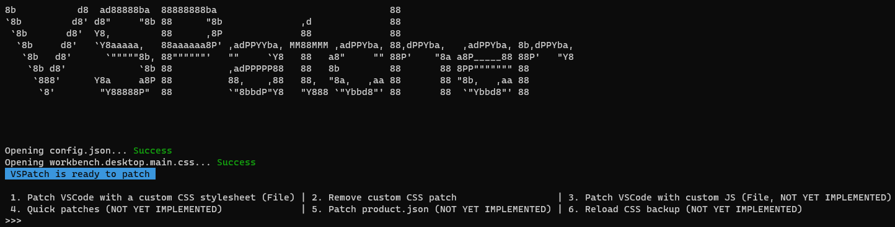

# VSPatcher (CLI)

A light-weight Python program to patch VSCode and customize its appearance

<picture>
  <source media="(prefers-color-scheme: dark)" srcset="res/preview/vspatch1.png">
  <source media="(prefers-color-scheme: light)" srcset="res/preview/vspatch1light.png">
  
</picture>

Add custom CSS, change the name of the program and change the logo inside the program with this CLI tool (Still in development)
