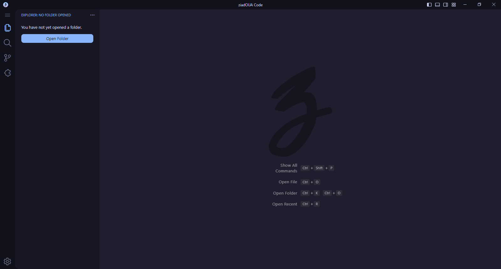
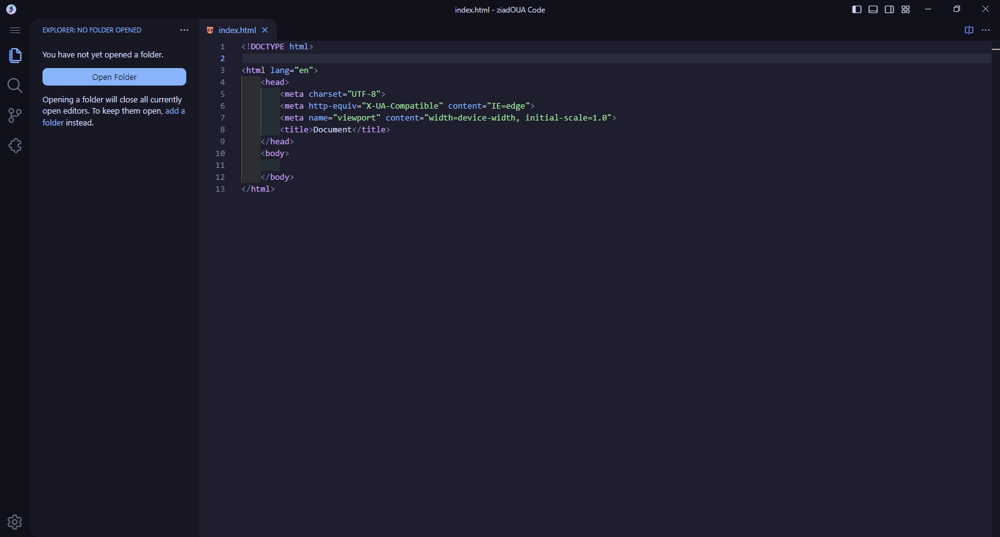

# About `patch.txt`

As the name indicates it, `patch.txt` is an example CSS patch.
It is more or less the patch I'm currently using.

# Preview

This patch works great with [Catppuccin](https://catppuccin.com) themes, but breaks the default VSCode light theme.
If you still use light themes, I suggest you using *Catppuccin Latte*.

I also deactivated the breadcrumbs, and added hover transitions.
